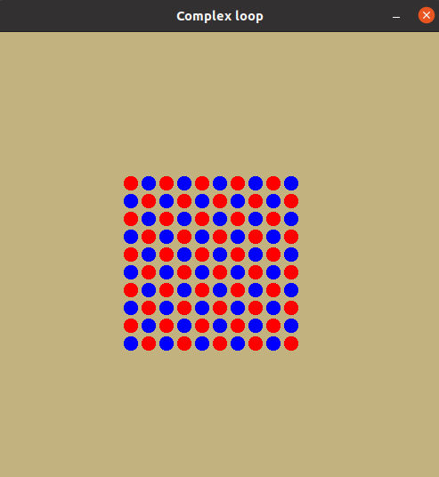
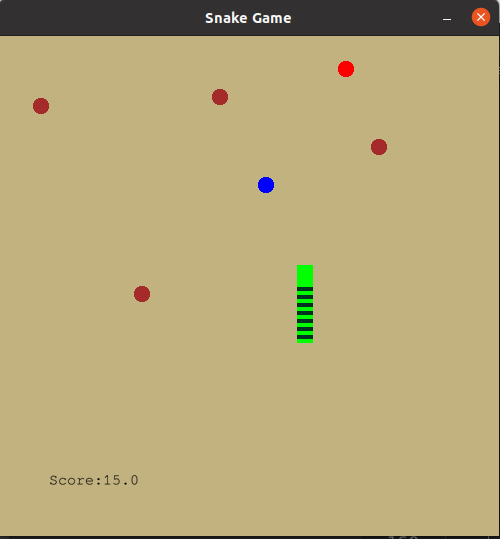

# Assignment11

1 - Draw the following output:

2 -Add the following features to the snake game:
- Score is displayed on the screen.
- Eating an apple gives one score.
- Eating a treat yields two points of score.
- Eating a Poo penalizes the player by one point of score.
- If score becomes zero 'Game Over' is displayed on the sceen.
- The game ends if the snake collides the edges.

