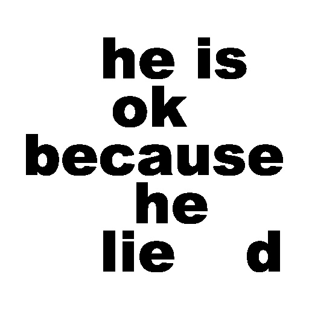
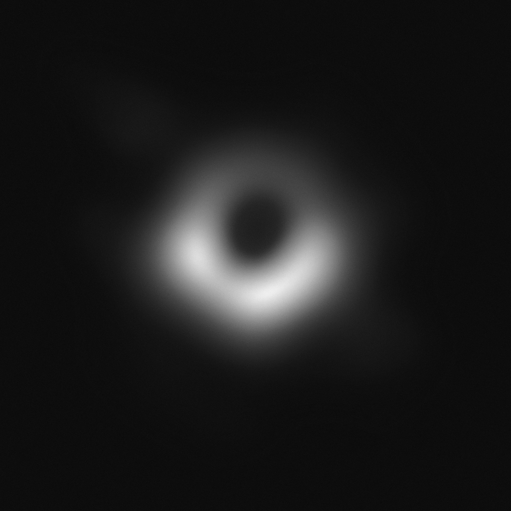
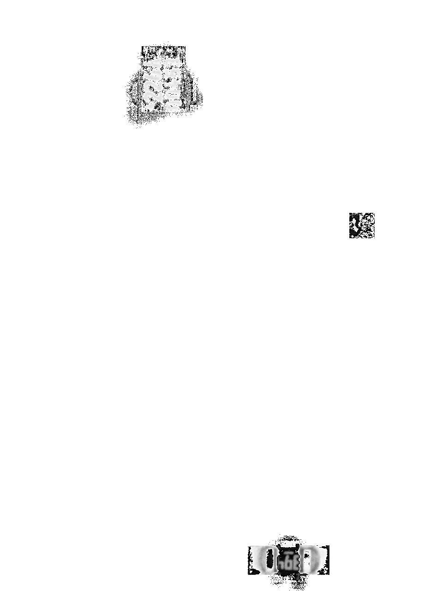
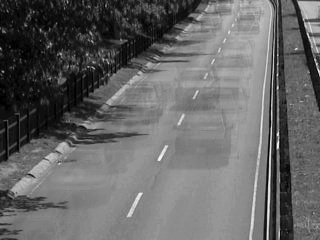
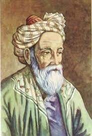
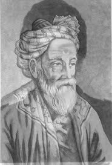
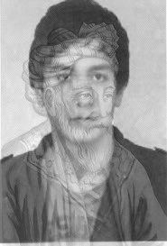
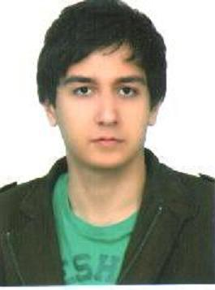
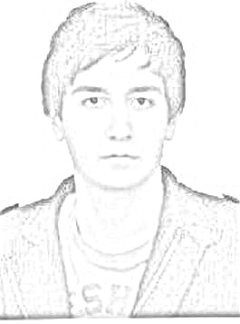
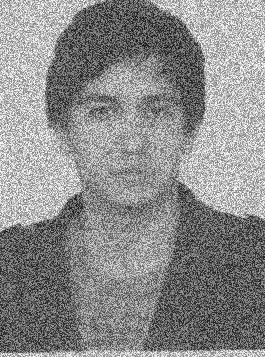

## ۱- رمز تصویر a و b را کشف نمایید.

<!-- 

 -->

## ۲- در سال 2019 به کمک تلسکوپ هایی که در سراسر کره زمین نصب شده بود و ادغام تصاویر دریافتی آن ها با یکدیگر، انسان توانست برای اولین بار از یک سیاه چاله عکس برداری نماید. شما نیز ابتدا نویز تصاویر هر بخش از سیاه چاله را کاهش دهید. سپس آن ها را به یکدیگر بچسبانید تا نتیجه نهایی بدست آید.

## ۳- در خط تولید کارخانه های تولید بردهای الکترونیکی، برای عیب یابی بردهای تولید شده، از یک بورد مرجع که صحت آن توسط کارشناسان تایید شده است، استفاده می شود. شما تصویر یک بورد origin و یک بورد test را در اختیار دارید. به کمک پردازش تصویر عیب های برد test را پیدا نمایید.

## ۴- از تصاویر اتوبان میانگین گیری نمایید. تا اتومبیل ها محو شوند و تصویر خیابان خالی بدست آید. 

## ۵- چهره خود را با چهره یک فرد مشهور ادغام کنید. مشابه شکل زیر، یک خروجی شامل ۴ تصویر متفاوت تولید کنید.

 
 
 

## ۶- عکس را به نقاشی تبدیل کنید. (برای راهنمایی به آدرس اینستاگرامی pylearn@ مراجعه نمایید)

## ۷- به یک تصویر بدون نویز، مقداری نویز اضافه کنید. 

