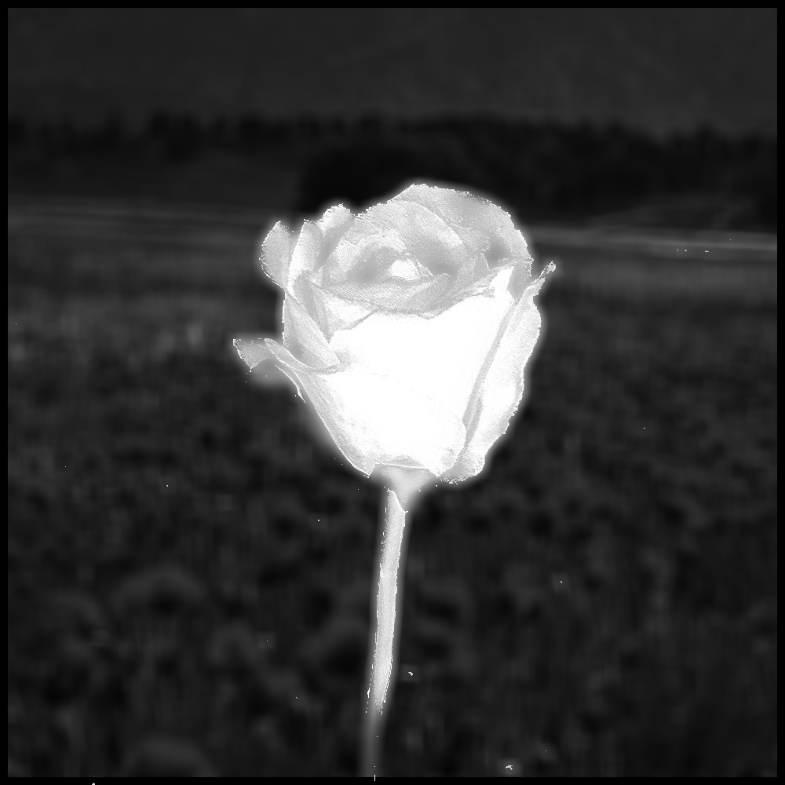
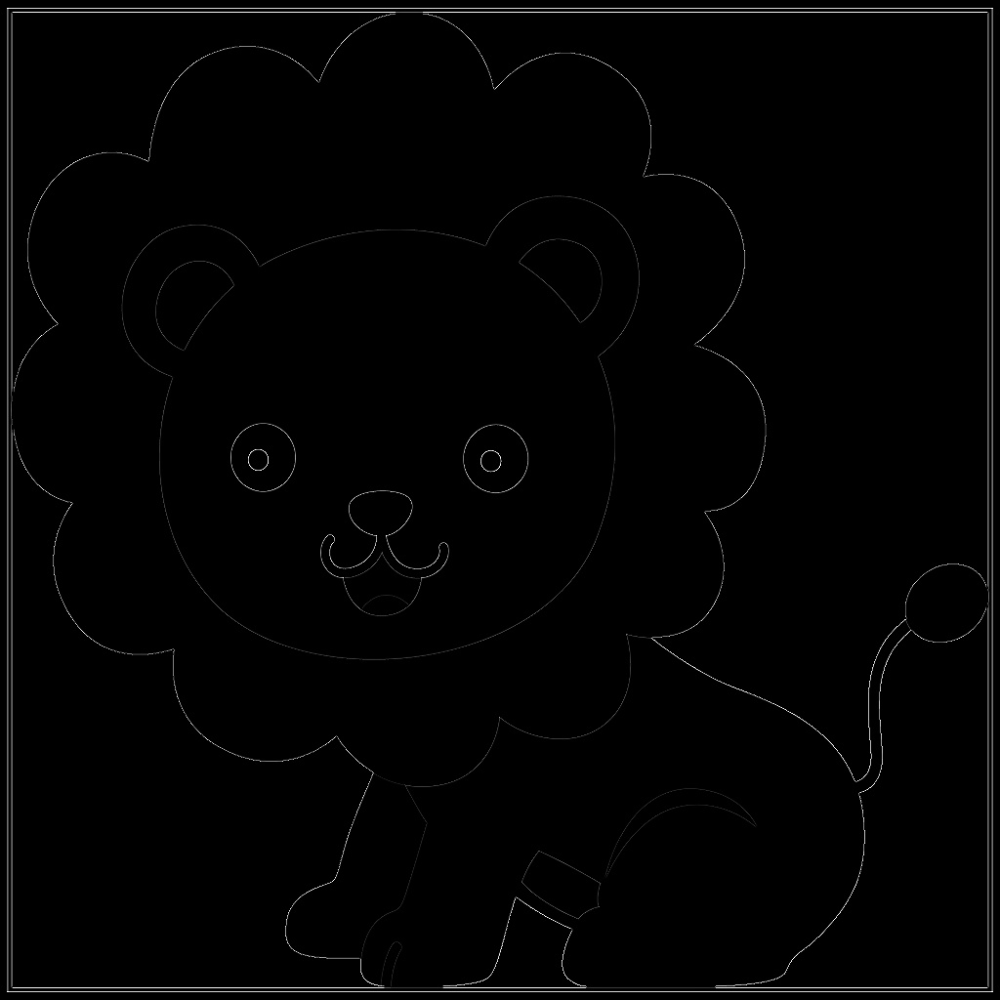
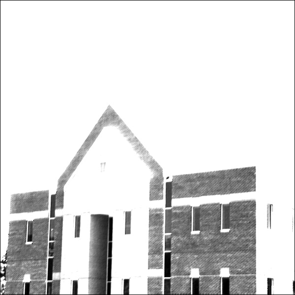
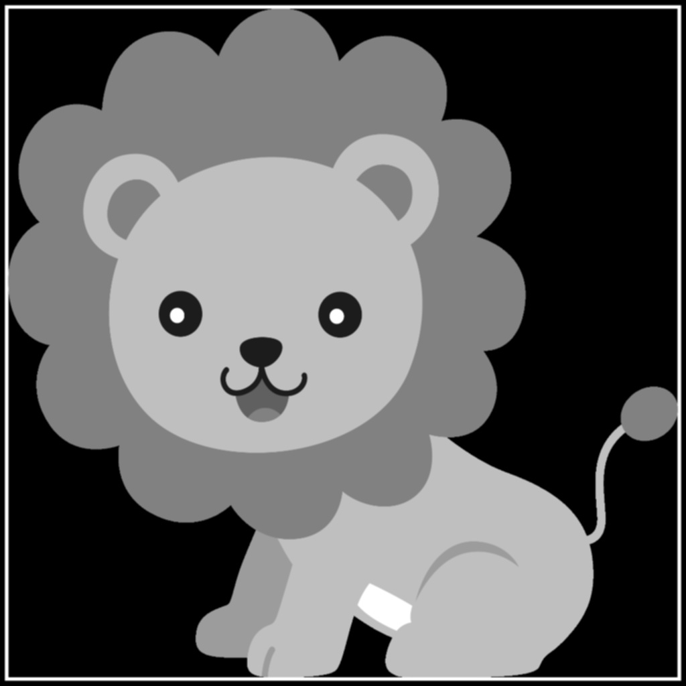

## Assignment25
### 1-Blur the image of a flower:

### 2- Convolve the given filter onto lion image:

### 3- Convolve the two given filters onto the image from the building:

### 4- Convolve given filters onto any image you desire.

