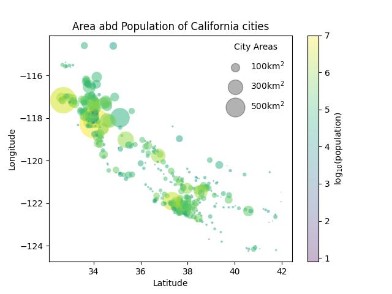

#### 🍎 and bananas 🍌 data analysis:

Scatter plot:

Bar chart with error bars:

Box diagram:

Histogram:

Joint distribution histogram:

Aspect ratio:

The measure of area:

Perimeter:

#### A dataset of random numbers for balloons 🎈 and melons 🍈 problem using three features: length, width and weight:

 #### California cities problem:

